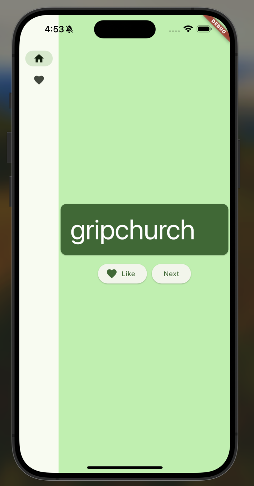
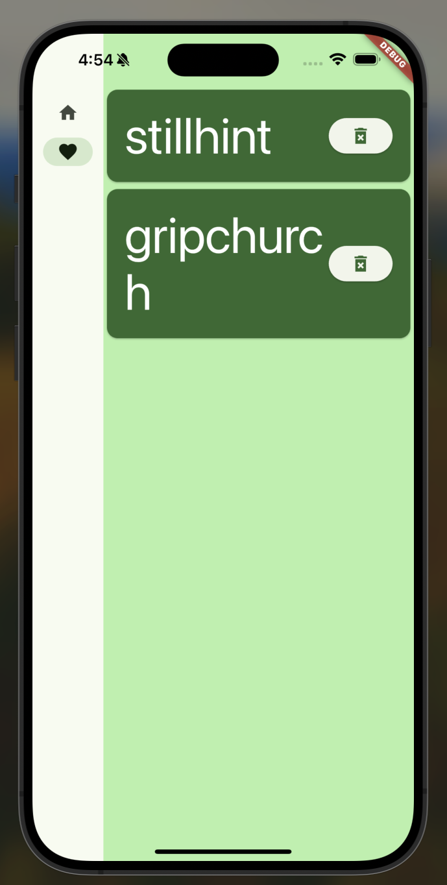
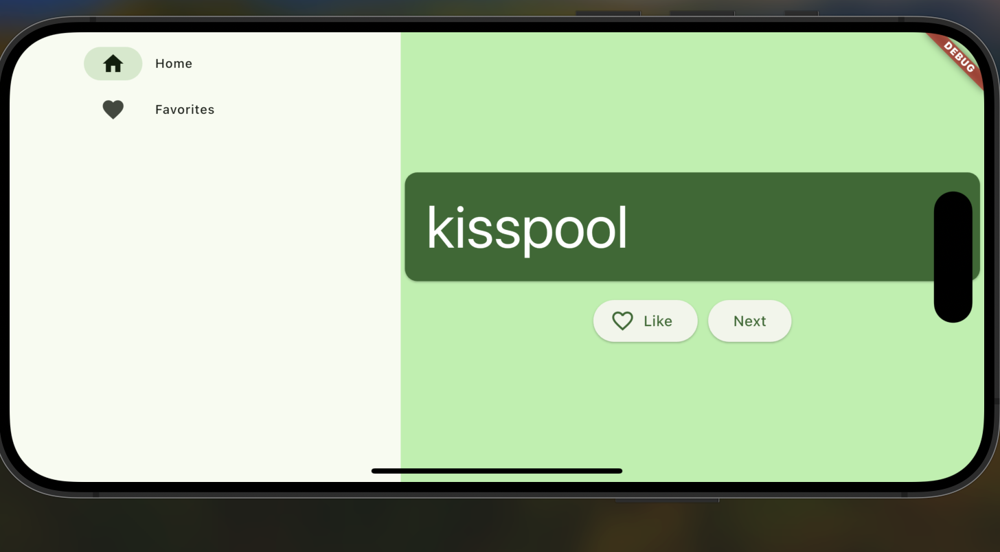

# Random Words

[中文](README_CN.md) | English

A Flutter starter project that generates random word pairs. This project is implemented following the [Flutter first app codelab](https://docs.flutter.dev/get-started/codelab).

## Features

- Generate infinite random word pairs
- Save favorite word pairs
- View and manage favorites list

## Screenshots

### Main Screen - Word Generation

### Favorites List

### When Rotate Screen

