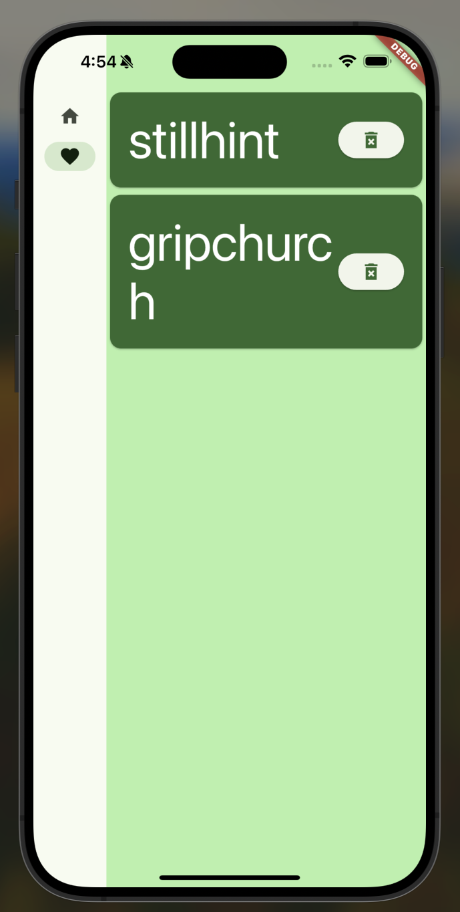

# Random Words (随机单词)

中文 | [English](README.md)

这是一个 Flutter 入门项目，用于生成随机单词对。项目参考 [Flutter 第一个应用教程](https://docs.flutter.dev/get-started/codelab) 实现。

## 功能点

- 生成无限随机单词对
- 收藏喜欢的单词对
- 查看和管理收藏列表

## 项目截图

### 主界面 - 单词生成

### 收藏列表

### 旋转屏幕
